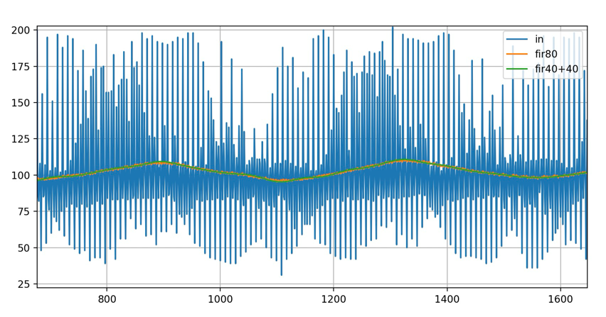

# Noise

The most obvious noise comes from the ADC itself. This noise can easily be reduced by increasing ADC conversion time and
sample averaging.

Another significant noise source are the loads connected to the battery.
The higher the impedance of the battery and wiring, the greater the noise.
Connect the MPPT charger and the loads separetly as close as possible to the battery terminals.
This will reduce noise coupling from the loads to the charger. Keep in mind that high frequency noise
can propagate more easily due to wire inductance, even when using very thick cables.
Noise can degrade tracking performance significantly.

Laptops can have a quite complex noise spectra that is difficult to describe.
A sliding median filter and a averaging filter are a good choice here.

A 50 Hz inverter has an 100 Hz ac component at the input (this is because we "see" `abs(sin(a*t))` at the input).
A notch filter can remove this quite well.

A median filter can filter load bursts.

https://github.com/Krampmeier/uncertainty

# Median
- filter spikes

## Residual Noise 
IIR filters have lower memory footprint and work faster compared to FIR. 
A disadvantage is the nonlinear phase response. Since we are just measuring dc amplitude, we don't use phase information.
Soo IIR filters are a good choice.
https://www.ni.com/docs/de-DE/bundle/diadem/page/genmaths/genmaths/calc_filterfir_iir.htm

* use iir
* multipass filters
* adaptive window length for given target noise

Lets have a look at the following signal.
It is the charger output current sampled by ina226 ADC (t_conv=1140µs, avg=1).
The charger was connected to a LFP battery and a cheap china inverter that produces heavy burst noise.
There is a slight 100 Hz ac component due to the sinusodial inverter input which has double the frequency of the 50Hz
220V output.

The useful signal has a triangular waveform, which comes from the MPPT perturbation.

Noisy signal (blue), moving average N=80 (orange) and 2-pass moving average N=40.

The 2-pass filter has a much better noise rejection:

IIR:

2-pass IIR:
