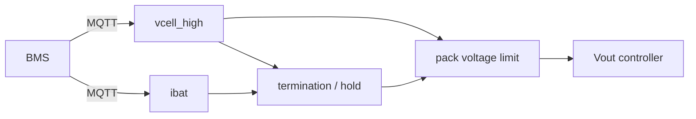

*this document is an LLM generated placeholder*

# BMS Integration

The charger subscribes to battery data a BMS publishes over MQTT and regulates on the highest cell voltage instead of
the pack voltage divided by the cell count.

## Why

A BMS may disconnect the battery at any time during charging, for example on a cell over-voltage. The resulting
transient at the charger output is only limited by the fast shutdown. With the cell voltages available, the charger
keeps the highest cell below the BMS cut-off instead:

- no BMS over-voltage cut-off and no disconnect transient,
- more time for cell balancing,
- proper [termination](termination.md) instead of a trickle charge into a full pack.

The firmware reads the BMS only from MQTT. A BMS on BLE, CAN bus or RS485 connects through a bridge that publishes
plain numbers to MQTT, for example [batmon-ha](https://github.com/fl4p/batmon-ha) for Bluetooth BMSes.

## Quick start

```
set-config mqtt.conf broker_uri mqtt://<broker-ip>:1883
set-config mqtt.conf username <user>
set-config mqtt.conf password <pass>
set-config mqtt.conf cell_voltages_max_topic <bms>/cell_voltages/max
set-config mqtt.conf ibat_topic <bms>/current
svc rs mqtt
status
```

The topic names depend on your BMS bridge. `status` shows the BMS feed (`vcell_high` with its age, `ibat`).

## Topics

All payloads are a plain decimal number, e.g. `3.412`. Configure the topics in
[`mqtt.conf`](../../reference/config/mqtt.md):

| `mqtt.conf` key | Payload | Used for |
|---|---|---|
| `cell_voltages_max_topic` | highest cell voltage, V | pack-voltage pinning, end-of-charge, termination |
| `ibat_topic` | battery current, A, positive while charging | termination, recharge counter, `partial_charge` hold, temperature derating |
| `ibat_lim_topic` | charge current limit, A (≥ 0) | overrides `charger.conf::ibat_max` at runtime |
| `bat_temp_topic` | pack temperature, °C; up to 4 comma-separated topics | `bat_temp_min` / `bat_temp_derate` / `bat_temp_max` policy |

:::danger Payloads must be plain numbers
On the current, limit and temperature topics only empty, `nan` or `inf` payloads (and negative values on
`ibat_lim_topic`) are logged and ignored. Any other text (e.g. Home Assistant's `unavailable`) currently parses as
**0** and is used, and a numeric prefix such as `3.4V` is accepted. A 0 °C pack temperature can clear a hot derate. On
`cell_voltages_max_topic` a non-numeric payload marks the cell data invalid and the limit falls back to
`Vbat_fallback`. Make sure the bridge never publishes non-numeric states to these topics.
:::

Temperatures outside −40…100 °C drop that sensor.

## How the data is used



- **Pack voltage limit.** The Vout setpoint is adjusted so that the highest cell stays at `charger.conf::cv_eoc`,
  instead of charging to `vout_max` blind. See [LFP charging](lfp-charging.md).
- **Termination.** Evaluated on each new cell-voltage frame, and only while both the cell-voltage and the current feed
  are fresh. See [Termination & recharge](termination.md).
- **Cell count.** Derived from the charger settings as `floor(vout_max / cv_eoc)`.

## Stale data and fallback

A feed is **stale** when no message arrived for 180 s (`VCELL_EXPIRATION_TIME_SEC` in `src/charger.h`; the same
timeout applies to `ibat`).

| Situation | Output voltage limit |
|---|---|
| Cell voltage fresh and `charger.conf::bat_c` set | regulated on the highest cell |
| Cell topic configured, no data yet (boot) | `Vbat_fallback` |
| Cell data goes stale | glides to `Vbat_fallback` over 5 s |
| No cell topic, or `bat_c` missing | `Vbat_fallback` |

`Vbat_fallback` is `charger.conf::vout_max_fallback`, by default `N_cells × cv_float` — the float voltage, which does
not overcharge a full pack. The effective limit is never above `charger.conf::vout_max`.

:::note
`vout_max_fallback` must be greater than `vout_offset_max` (default 0.6 V). A smaller value, including `0`, is
rejected at boot: setup fails and the converter stays off, with the console available to fix the file. There is no
setting that stops the converter when BMS data is missing; it holds the fallback voltage instead.
:::

:::warning
Without a fresh `ibat` feed there is no termination, no `partial_charge` hold and no recharge counting. The
temperature policy then falls back to an output-current limit. Check that both feeds are live in `status`.
:::

## Common scenarios

### Several chargers on one battery

Point every charger at the same BMS topics. Each charger regulates independently on the same highest cell voltage.

### Limit charge current from the BMS

Publish the allowed current to the topic in `ibat_lim_topic`, e.g. a BMS that reduces current near full or at low
temperature. Each message replaces the current limit; the `iset` console command and `charger.conf::ibat_max` set
the same value.

### Verify the link

```
status
svc list
```

`svc list` must show `mqtt` running; `status` must show a fresh `vcell_high`. For topics the device publishes itself,
see [MQTT topics](../../reference/mqtt.md).
