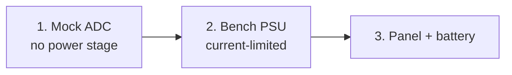

# First Power-Up

Bring a new board up in three stages — mock ADC, bench supply, real panel and battery — and only move on once the
readings of the current stage make sense.

:::danger High voltage and high current
A solar array delivers its short-circuit current into a fault, and a battery delivers far more. A firmware or
configuration error can put the full panel voltage on the battery terminals or short the half-bridge. Work with
fused wiring, keep a hand on a disconnect, and never leave a first bring-up unattended.
:::

## Checklist



| Stage | Config | Power | Verify |
|---|---|---|---|
| 1 | `config/lab/dry_mock` (copy) | USB only | firmware boots, console, Wi-Fi, services |
| 2 | your board config | current-limited lab supply on the input | `sensor` readings match a multimeter, limits hold |
| 3 | your board config | panel + battery (+ BMS) | charging, termination, telemetry |

## Stage 1: mock ADC

`config/lab/dry_mock` replaces all sensors with a fake ADC producing sinusoidal readings, so the control loop runs
without a power stage.

```bash
cp -r config/lab/dry_mock /tmp/mock
cp config/fmetal/conf/charger.conf /tmp/mock/conf/   # dry_mock has no charger.conf
rm -f /tmp/mock/conf/mqtt.conf                        # lab broker settings, not yours
export ESPPORT=/dev/cu.usbmodemXXXX
./provision.py /tmp/mock
python3 etc/fugu_console.py -p $ESPPORT
```

The firmware requires `charger.conf::vout_max`. Without it, setup logs
`error during sensor/converter/tracker setup: vout_max must be a positive finite voltage …` and the control loop
does not start.

In the console:

```
uptime
sensor
status
wifi-add <ssid>:<password>
restart
```

Check:

- [ ] No `E (…)` error lines in the boot log. `board.conf expects MCU …` means the config does not match the chip,
  see [ESP32 variants](../hardware/esp32-variants.md).
- [ ] `sensor` lists `vin`, `vout`, `iout` with changing values.
- [ ] `ip` shows an address after the restart, and `svc list` shows the network services you expect.

:::danger
Never provision a mock configuration on a board that is wired to a panel, supply or battery. The protections act on
the fake readings, not on the real voltages.
:::

## Stage 2: bench supply

Provision your real board configuration (for Fugu2: `./provision.py fmetal`) and power the input from a lab supply.

### Before you switch on

- [ ] Review [`limits.conf`](../../reference/config/limits.md) with `cat conf/limits.conf`. Set `vin_max`,
  `vout_max`, `iin_max` and `iout_max` to what your hardware and your battery tolerate, not to the example values.
- [ ] `charger.conf::vout_max` matches the battery you will connect later
  ([LFP charging](../charging/lfp-charging.md)).
- [ ] `coil.conf::L0` matches your inductor; diode emulation relies on it
  ([diode emulation](../../internals/diode-emulation.md)).
- [ ] Supply voltage above `limits.conf::vin_min` (10.5 V in the examples, protects the board supply) and below
  `vin_max`.
- [ ] Supply current limit set **low** (a few hundred mA) for the first run.

### Readings

With only the input supply connected and the output open:

- [ ] `sensor`: Vin matches a multimeter within a few percent. If not, fix `vin_rh`/`vin_rl` in
  [`sensor.conf`](../../reference/config/sensor.md).
- [ ] Current readings sit near zero; the sampler calibrates the zero-current offset at start.
- [ ] `status` shows the limits you configured.
- [ ] While idle the log names what blocks a start, e.g. `START blocked: Vin-Vout (Vin=12.4 Vout=12.9 …)`. A buck
  needs Vin above Vout + 1 V; a boost needs Vin below Vout + 1 V.

Then connect a load or a second supply/battery simulator on the output and let the converter start. Watch `status`
and the log; any protection trip is logged with its reason.

:::warning Manual duty
`dc N` and `+N`/`-N` drive the half-bridge directly (protections stay active). Start with small values and small
steps; large positive jumps can cause current transients that destroy the switches. `dc 0` always stops the
converter. See [Operating modes](../operating-modes.md).
:::

## Stage 3: panel and battery

- [ ] Connect the battery first, then the panel.
- [ ] Confirm Vout in `sensor` equals the battery voltage before the first sweep.
- [ ] Let the converter start on its own: it runs a global sweep, then tracks the MPP.
- [ ] If a BMS publishes cell voltages over MQTT, set up [BMS integration](../charging/bms-integration.md) and check
  that `status` shows a fresh `vcell_high`.
- [ ] Add [telemetry](../telemetry/index.md) to watch the first days of operation.

:::danger Battery disconnect
If the battery or load is removed during conversion, expect an over-voltage transient at the output. A failed
converter may put the full panel voltage on the output. Protect connected devices (TVS, crowbar, second DC/DC) where
they cannot tolerate that.
:::

## Common scenarios

| Symptom | Where to look |
|---|---|
| `Never got a sample! Please check ADC` | ADC backend, I²C pins, `ina22x_*`/`ads_alert` pins in `board.conf` |
| `Calibration failed, <sensor> …` | Sensor not at rest at boot, or wrong `_midpoint`/`_factor` |
| `START blocked: supply-UV` | The higher of Vin and Vout is below ~9.8 V, too low for the board supply |
| `START blocked: temp` | NTC or MCU temperature within 3 °C of `limits.conf::temp_max`, or MCU temperature unavailable; check `ntc_ch` |
| Protection trips at low power | Divider values or current `_factor` sign in `sensor.conf` |

More in [Troubleshooting](../troubleshooting.md).
