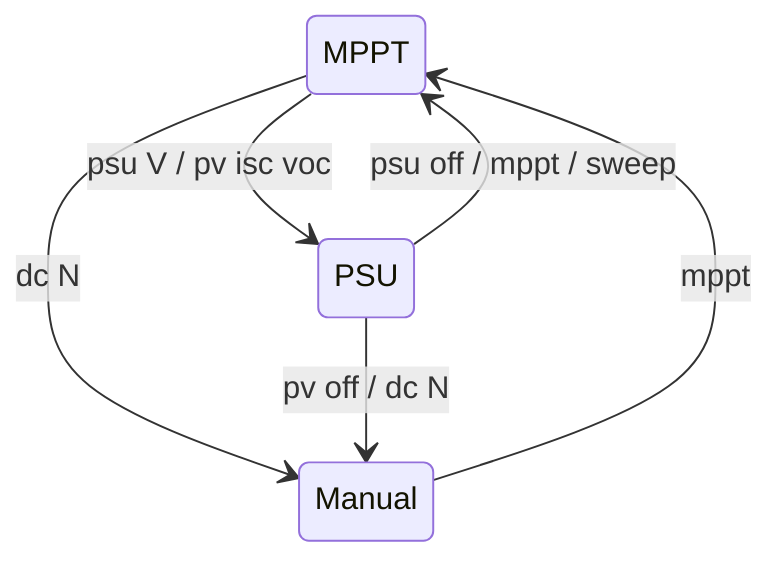

# Operating Modes

The converter runs in one of three modes: MPPT, manual PWM, or PSU (constant voltage, including the PV simulator).
`converter.conf` selects the mode at boot, and the [console](../reference/console.md) switches it live.

:::danger Half-bridge safety
Manual duty, forced PWM, PSU and PV-sim modes drive the half-bridge directly or regulate against a stiff source.
A wrong duty or setpoint can push hundreds of amps through the switches or put the input voltage on the output.
Use a current-limited supply for first tests and keep a scope on the switch node when changing timing.
`dc 0` stops the converter from any mode once it replies OK.
:::

## Quick start

These three commands show the state, stop the converter, and return to tracking:

```
status          # current mode, limits, charger state
dc 0            # stop: manual mode, duty 0
mppt            # back to automatic MPP tracking
```

## Modes

The following table shows how to enter and leave each mode and what the mode regulates:

| Mode | Enter | Leave | Regulates |
|---|---|---|---|
| MPPT (default) | boot with `mode` unset or `mode=mppt`; `mppt`; `psu off` | `dc N`, `psu <V>`, `pv …` | input power, within the limiters and charger voltage |
| Manual PWM | `dc N`; `tracker.conf::target_duty_cycle` at boot; `pv off` | `mppt` | nothing: fixed duty, protections still active |
| PSU | `psu <V>`; `mode=psu` at boot | `psu off`, `mppt`, `sweep`, `dc N` (to manual) | Vout to the setpoint, CV/CC foldback |
| PV simulator | `pv <isc> <voc> [k]`; `mode=pv` at boot | `pv off` (to manual), `mppt` | Vout along a PV curve V = f(Iout) |

The topology (`converter.conf::topo=buck|boost`) is independent of the mode.

The console commands move the converter between modes as follows:



## MPPT

The tracker starts with a global sweep from duty 0 upwards, captures the maximum power point, then follows it with
fast and later slow perturb-and-observe. A new sweep runs every 30 minutes unless the battery is full, and `sweep`
starts one on demand.

Five PD limiters (Vin, Iin, Vout, Iout, power) run on every sample. The most restrictive one wins and overrides the
tracker. The Vout limit comes from the charger. For details, see [LFP charging](charging/lfp-charging.md). Tracker
settings are in [`tracker.conf`](../reference/config/tracker.md), and gains are in
[`converter.conf`](../reference/config/converter.md).

These commands control the tracker:

| Command | Effect |
|---|---|
| `sweep` | Start a global scan now (also leaves PSU mode) |
| `speed <s>` | Tracking speed scale, 0 ≤ s < 10, default 1.0 |
| `+N` / `-N` | Perturb the duty by N counts, also while tracking (rejected in PSU mode) |

## Manual PWM

In manual mode, the converter holds a fixed duty that you set and step from the console:

```
dc 200          # fixed duty of 200 counts, switches to manual mode
+5              # step up
-20             # step down
dc 0            # stop
mppt            # resume tracking
```

The following rules apply in manual mode:

- `dc N` accepts 0 up to the driver's maximum count and prints the range when out of bounds.
- While the sensors calibrate, a non-zero duty is refused, but `dc 0` is accepted.
- While an on-device coil measurement runs (`CONFIG_FUGU_WITH_MEASURE_COIL`), every `dc` command, including `dc 0`,
  is rejected with `dc: busy measuring` until the measurement finishes.
- If the control loop does not take `dc 0` within ~1 s, it fails with `RT transition timed out`.
- If `dc` fails in either of these cases, assume nothing was stopped. Check the reply.
- Protections stay active. Unless `limits.conf::reverse_current_paranoia` is set, a non-zero duty enables synchronous
  rectification and the backflow switch.
- `sync` and `bf` require manual mode. `short-ls` works from any mode on a boost converter with `Vin` ≈ 0 and
  switches to manual mode itself. See [console](../reference/console.md#manual-pwm-commands).
- `tracker.conf::target_duty_cycle` (a fraction of the maximum duty) boots straight into manual mode at that duty.
  It overrides `mode=psu|pv`.

:::warning
Large positive steps (`+N`, `dc N`) can cause current transients that destroy the switches. Step in small
increments and watch `sensor`.
:::

## PSU (constant voltage)

In PSU mode, the converter regulates its output to a setpoint, with no tracker, no periodic sweep, and no battery
logic. The limiter chain provides current and power foldback.

These commands enter, inspect, and leave PSU mode:

```
psu 24          # enter PSU mode at 24 V
psu             # print setpoint, trip count, latch state
psu off         # back to MPPT
```

To persist PSU mode, set it in `converter.conf`:

```ini
mode=psu
psu_vout=24
```

The following limits and fault rules apply in PSU mode:

- The setpoint is range-checked against the output voltage limit (`limits.conf::lv_max` in a buck, `hv_max` in a
  boost, legacy `vout_max`).
- In boost topology the setpoint must exceed Vin by at least 0.5 V.
- Output over-voltage and supply under-voltage trips retry fast. Within 60 s, the first 4 trips retry after 100 ms,
  trips 5-8 use the normal backoff, and the 9th latches the output off (`psu` shows the latch). Other faults use their
  normal backoff. Any mode command (`psu <V>`, `psu off`, `mppt`, `dc`) clears the latch.
- `+N`/`-N` are rejected. Use `psu off` first.

`config/psu_12v` uses MPPT mode instead, with `forced_pwm=1` and the output voltage set in
`charger.conf::vout_max`. See [Supported boards](hardware/supported-boards.md#12-v-power-supply).

## PV simulator

The PV simulator is a PSU variant for bench work. The output follows a solar panel curve, with `Voc` at no load and
the MPP at `k·Voc`, so another converter can track it like a real panel.

These commands set, scale, inspect, and stop the simulated panel:

```
pv 8 40         # Isc = 8 A, Voc = 40 V, k = 0.8
pv 8 40 0.75    # k in [0.5, 0.95]
pv scale 0.5    # irradiance: Isc = 0.5 x the last full pv command
pv              # curve, live setpoint, trip state
pv off          # ramp to duty 0, manual mode
```

To start the simulator at boot, set the curve in `converter.conf`:

```ini title="converter.conf"
mode=pv
pv_isc=8
pv_voc=40
pv_k=0.8
```

The simulator behaves as follows:

- The setpoint moves along the curve, slew-limited by `pv_slew` (V/s) and clamped to
  [Vin + 0.5 V, min(Voc, Vout max)], where Vout max is `limits.conf::hv_max` in a boost (legacy `vout_max`). A boost can only emulate the part of the curve above Vin.
- The Iout limiter is capped at 1.1 × Isc.
- `pv off` goes to manual mode, not MPPT, since a simulator is a bench source.

:::danger
Below the Vin floor the body diode conducts current the firmware cannot limit. Keep the current limit of the supply
feeding the simulator low.
:::

The [power-loop rig](../lab/power-loop.md) uses a boost in `mode=pv` as the source for a buck under test.

## Common scenarios

The following table lists the commands for common tasks:

| Goal | Commands |
|---|---|
| Stop conversion now | `dc 0` |
| Stop before an OTA at high power | `dc 0`, confirm the OK reply (or `status`) before updating; the reboot resumes the configured mode |
| Fixed output voltage from a battery | `topo=boost`, `mode=psu`, `psu_vout=<V>` |
| Test a charger against a simulated panel | simulator: `mode=pv`; charger under test: normal MPPT |
| Inspect the tracker | `+N`/`-N` while tracking, then watch it recover |

See also: [Console reference](../reference/console.md), [`converter.conf`](../reference/config/converter.md),
[MPP tracker internals](../internals/mppt-tracker.md), [Lab](../lab/index.md).
