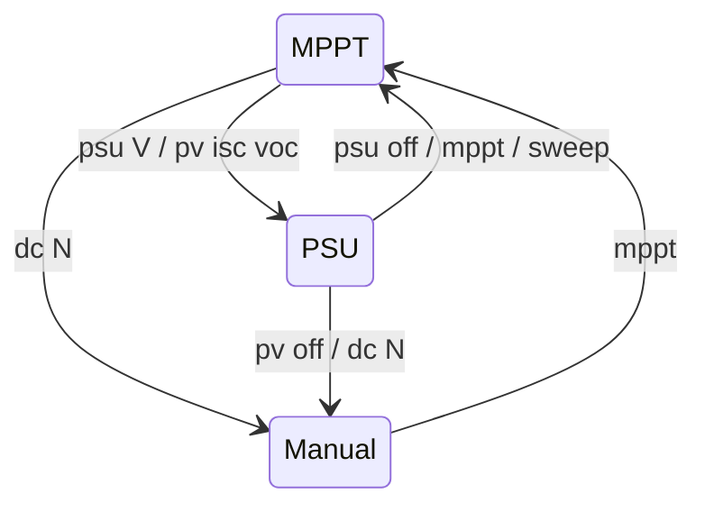

*this document is an LLM generated placeholder*

# Operating Modes

The converter runs in one of three modes — MPPT, manual PWM or PSU (constant voltage, including the PV simulator) —
selected at boot by `converter.conf` and switched live from the [console](../reference/console.md).

:::danger Half-bridge safety
Manual duty, forced PWM, PSU and PV-sim modes drive the half-bridge directly or regulate against a stiff source.
A wrong duty or setpoint can push hundreds of amps through the switches or put the input voltage on the output.
Use a current-limited supply for first tests, keep a scope on the switch node when changing timing, and know that
`dc 0` stops the converter from any mode once it replies OK.
:::

## Quick start

```
status          # current mode, limits, charger state
dc 0            # stop: manual mode, duty 0
mppt            # back to automatic MPP tracking
```

## Modes

| Mode | Enter | Leave | Regulates |
|---|---|---|---|
| MPPT (default) | boot with `mode` unset or `mode=mppt`; `mppt`; `psu off` | `dc N`, `psu <V>`, `pv …` | input power, within the limiters and charger voltage |
| Manual PWM | `dc N`; `tracker.conf::target_duty_cycle` at boot; `pv off` | `mppt` | nothing: fixed duty, protections still active |
| PSU | `psu <V>`; `mode=psu` at boot | `psu off`, `mppt`, `sweep` | Vout to the setpoint, CV/CC foldback |
| PV simulator | `pv <isc> <voc> [k]`; `mode=pv` at boot | `pv off` (to manual), `mppt` | Vout along a PV curve V = f(Iout) |

The topology (`converter.conf::topo=buck|boost`) is independent of the mode.



## MPPT

The tracker starts with a global sweep from duty 0 upwards, captures the maximum power point, then follows it with
fast and later slow perturb-and-observe. A new sweep runs every 30 minutes unless the battery is full, and `sweep`
starts one on demand.

Five PD limiters (Vin, Iin, Vout, Iout, power) run on every sample; the most restrictive one wins and overrides the
tracker. The Vout limit comes from the charger, see [LFP charging](charging/lfp-charging.md). Tracker settings are in
[`tracker.conf`](../reference/config/tracker.md); gains in [`converter.conf`](../reference/config/converter.md).

| Command | Effect |
|---|---|
| `sweep` | Start a global scan now (also leaves PSU mode) |
| `speed <s>` | Tracking speed scale, 0 ≤ s < 10, default 1.0 |
| `+N` / `-N` | Perturb the duty by N counts, also while tracking (rejected in PSU mode) |

## Manual PWM

```
dc 200          # fixed duty of 200 counts, switches to manual mode
+5              # step up
-20             # step down
dc 0            # stop
mppt            # resume tracking
```

- `dc N` accepts 0 up to the driver's maximum count and prints the range when out of bounds. A non-zero duty is
  refused while the sensors calibrate. `dc 0` is accepted then too, but **not** while an on-device coil
  measurement runs (`CONFIG_FUGU_WITH_MEASURE_COIL`): every `dc` command is rejected with `dc: busy measuring`
  until it finishes. `dc 0` also fails with `RT transition timed out` if the control loop does not take it within
  ~1 s. In both failure cases assume nothing was stopped: check the reply.
- Protections stay active. A non-zero duty enables synchronous rectification and the backflow switch unless
  `limits.conf::reverse_current_paranoia` is set.
- `sync`, `bf` and `short-ls` require manual mode, see [console](../reference/console.md#manual-pwm-commands).
- `tracker.conf::target_duty_cycle` (a fraction of the maximum duty) boots straight into manual mode at that duty.
  It overrides `mode=psu|pv`.

:::warning
Large positive steps (`+N`, `dc N`) can cause current transients that destroy the switches. Step in small
increments and watch `sensor`.
:::

## PSU (constant voltage)

The converter regulates its output to a setpoint, with no tracker, no periodic sweep and no battery logic. The
limiter chain provides current and power foldback.

```
psu 24          # enter PSU mode at 24 V
psu             # print setpoint, trip count, latch state
psu off         # back to MPPT
```

Persist it in `converter.conf`:

```ini
mode=psu
psu_vout=24
```

- The setpoint is range-checked against `limits.conf::vout_max`.
- In boost topology the setpoint must exceed Vin by at least 0.5 V.
- Output over-voltage and supply under-voltage trips retry fast: within 60 s the first 4 trips retry after 100 ms,
  trips 5-8 use the normal backoff, and the 9th latches the output off (`psu` shows the latch). Other faults use their
  normal backoff. Any mode command (`psu <V>`, `psu off`, `mppt`, `dc`) clears the latch.
- `+N`/`-N` are rejected; use `psu off` first.

`config/psu_12v` is a different approach: MPPT mode with `forced_pwm=1` and the output voltage in
`charger.conf::vout_max`, see [Supported boards](hardware/supported-boards.md#12-v-power-supply).

## PV simulator

A PSU variant for bench work: the output follows a solar panel curve, with `Voc` at no load and the MPP at `k·Voc`,
so another converter can track it like a real panel.

```
pv 8 40         # Isc = 8 A, Voc = 40 V, k = 0.8
pv 8 40 0.75    # k in [0.5, 0.95]
pv scale 0.5    # irradiance: Isc = 0.5 x the last full pv command
pv              # curve, live setpoint, trip state
pv off          # ramp to duty 0, manual mode
```

```ini title="converter.conf"
mode=pv
pv_isc=8
pv_voc=40
pv_k=0.8
```

- The setpoint moves along the curve, slew-limited by `pv_slew` (V/s) and clamped to
  [Vin + 0.5 V, min(Voc, `vout_max`)]. A boost can only emulate the part of the curve above Vin.
- The Iout limiter is capped at 1.1 × Isc.
- `pv off` goes to manual mode, not MPPT, since a simulator is a bench source.

:::danger
Below the Vin floor the body diode conducts current the firmware cannot limit. Keep the current limit of the supply
feeding the simulator low.
:::

The [power-loop rig](../lab/power-loop.md) uses a boost in `mode=pv` as the source for a buck under test.

## Common scenarios

| Goal | Commands |
|---|---|
| Stop conversion now | `dc 0` |
| Stop before an OTA at high power | `dc 0`, confirm the OK reply (or `status`) before updating; the reboot resumes the configured mode |
| Fixed output voltage from a battery | `topo=boost`, `mode=psu`, `psu_vout=<V>` |
| Test a charger against a simulated panel | simulator: `mode=pv`; charger under test: normal MPPT |
| Inspect the tracker | `+N`/`-N` while tracking, then watch it recover |

See also: [Console reference](../reference/console.md), [`converter.conf`](../reference/config/converter.md),
[MPPT tracker internals](../internals/mppt-tracker.md), [Lab](../lab/index.md).
