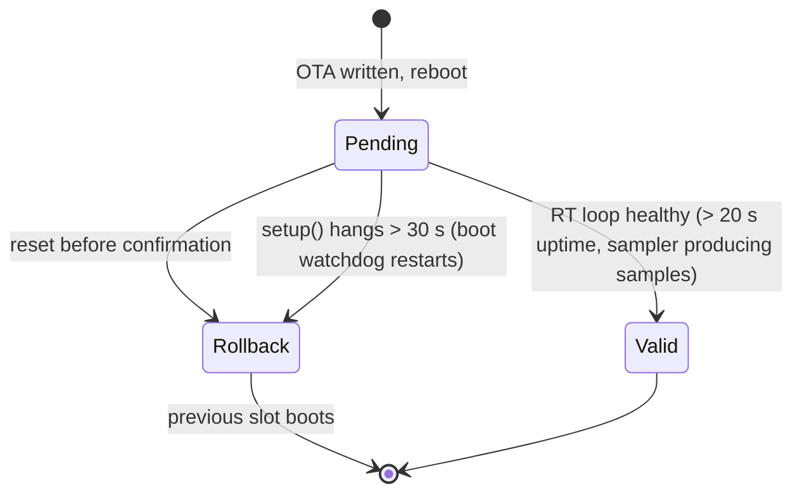

*this document is an LLM generated placeholder*

# OTA Updates

Devices update their firmware over Wi-Fi by downloading an image from an HTTP(S) URL into the inactive OTA slot.
A freshly updated image must prove itself healthy, or the bootloader rolls back to the previous one.
For devices without Wi-Fi, see [OTA over BLE](ota-ble.md).

## Quick start

```bash
./ota.sh                                          # build, serve build/ on :9000, update all devices
PYTHONPATH=./ .venv/bin/python3 etc/ota.py -n     # dry run: discover + show versions only
PYTHONPATH=./ .venv/bin/python3 etc/ota.py -m garage  # update devices whose hostname matches "garage"
```

Run from the repository root. `etc/ota.py` discovers devices, serves `build/fugu-firmware.bin` on port 9000 with a
URL built from the host IP as the device sees it (so it also works when the device sits behind NAT), sends `ota <url>` to each
device and prints a before/after version table.

| Flag | Effect |
|---|---|
| `-n`, `--dry-run` | Discover and show which hosts would update; send nothing |
| `-m REGEX`, `--match REGEX` | Only update devices whose hostname matches |
| `-f`, `--force` | Update even if the device already runs the local build's version |

:::warning Live converters
An OTA reboots the device into the new image. On converters connected to panels and a battery, run `-n` first
and scope the update with `-m`. At high power, stop conversion (`dc 0`) before updating.
:::

## Manual update

Any HTTP server reachable from the device works:

```bash
python3 -m http.server 9000 --directory build
```

```
ota http://<host-ip>:9000/fugu-firmware.bin
```

The `ota` [console command](../../reference/console.md) halts the converter and ADC during the download.

## Rollback and boot watchdog

The bootloader is built with `CONFIG_BOOTLOADER_APP_ROLLBACK_ENABLE=y`, so a new OTA image boots as
*pending verify*:



- `lfMarkOtaValid()` confirms the image only once the real-time loop is proven healthy.
- A 30 s boot watchdog, armed at the top of `setup()`, restarts the device if setup never finishes; with rollback
  that lands on the previous good slot.
- Images flashed over serial are not *pending verify*, so the confirmation is a no-op there.

:::danger Rollback needs the new bootloader
Rollback is a bootloader feature, and an OTA writes only the app. A device whose bootloader predates rollback
support will brick, not revert, on a bad image. Serial-flash bootloader and app once (keeping the littlefs
partition) to enable rollback; later OTAs are then protected. A device that hangs before Wi-Fi comes up can only
be recovered over serial.
:::

## ELF archive

After each verified OTA, `etc/ota.py` archives the build ELF so coredumps from that device can be decoded later.
See [Debugging](../../development/debugging/index.md#coredumps).
