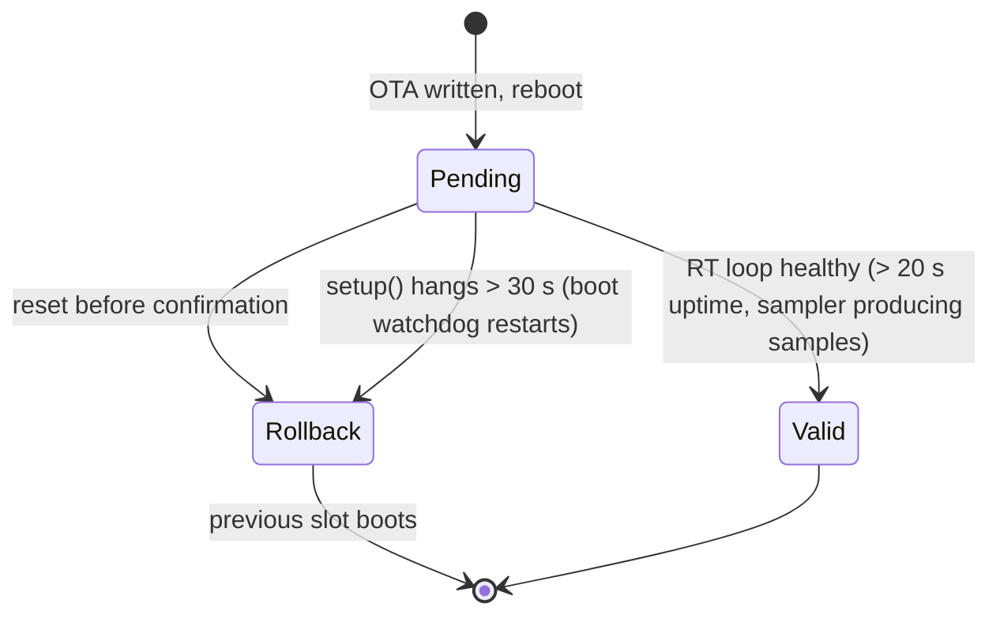

# OTA Updates

Devices update their firmware over Wi-Fi by downloading an image from an HTTP(S) URL into the inactive OTA slot.
A freshly updated image must prove itself healthy, or the bootloader rolls back to the previous one.
For devices without Wi-Fi, see [OTA over BLE](ota-ble.md).

## Quick start

Run these commands from the repository root to build the firmware and update devices:

```bash
# ESP-IDF exported; once: python -m pip install zeroconf
idf.py build
PYTHONPATH=. python etc/ota.py -n              # dry run: discover + show versions only
PYTHONPATH=. python etc/ota.py -m <hostname>   # update devices whose hostname matches
```

`./ota.sh <args>` is a shortcut that runs `idf.py build`, then `etc/ota.py <args>`. It refuses to run (exit 2)
unless the arguments contain `-n`/`--dry-run` or `-m`/`--match`, each as its own word, so it never updates every
discovered device by accident. When `idf.py` is not on `PATH`, it sources `$IDF_PATH/export.sh`, or
`../../esp/idf5.5/export.sh` if `IDF_PATH` is unset.

`etc/ota.py` discovers devices and serves `build/fugu-firmware.bin` on port 9000. It builds the URL from the host IP
as the device sees it, so the update also works when the device sits behind NAT. It then sends `ota <url>` to each
device and prints a before/after version table.

`etc/ota.py` accepts these flags:

| Flag | Effect |
|---|---|
| `-n`, `--dry-run` | Discover and show which hosts would update; send nothing |
| `-m REGEX`, `--match REGEX` | Only update devices whose hostname matches |
| `-f`, `--force` | Update even if the device already runs the local build's version |

:::warning Live converters
An OTA reboots the device into the new image. On converters connected to panels and a battery, run `-n` first
and scope the update with `-m`. At high power, stop conversion (`dc 0`) before updating.
:::

## Manual update

To update a device without `etc/ota.py`, serve the image from any HTTP server the device can reach. For example:

```bash
python3 -m http.server 9000 --directory build
```

Then send the `ota` command to the device:

```
ota http://<host-ip>:9000/fugu-firmware.bin
```

The `ota` [console command](../../reference/console.md) halts the converter and ADC during the download.

## Rollback and boot watchdog

The bootloader is built with `CONFIG_BOOTLOADER_APP_ROLLBACK_ENABLE=y`, so a new OTA image boots as
*pending verify*. The diagram shows how the image leaves that state:



The confirmation and the watchdog behave as follows:

- `lfMarkOtaValid()` confirms the image only once the real-time loop is proven healthy.
- A 30 s boot watchdog, armed at the top of `setup()`, restarts the device if setup never finishes. With rollback,
  that restart lands on the previous good slot.
- Images flashed over serial are not *pending verify*, so the confirmation is a no-op there.

:::danger Rollback needs the new bootloader
Rollback is a bootloader feature, and an OTA writes only the app. A device whose bootloader predates rollback
support will brick, not revert, on a bad image. Serial-flash bootloader and app once (keeping the littlefs
partition) to enable rollback. Later OTAs are then protected. A device that hangs before Wi-Fi comes up can only
be recovered over serial.
:::

## ELF archive

After each verified OTA, `etc/ota.py` archives the build ELF so coredumps from that device can be decoded later.
See [Debugging](../../development/debugging/index.md#coredumps).
