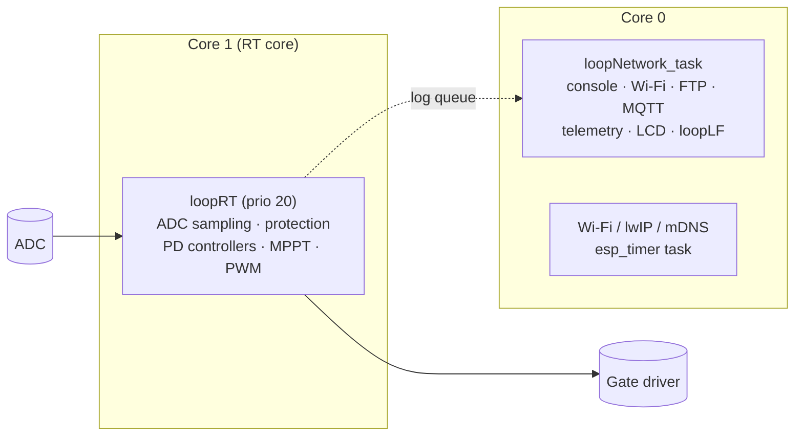
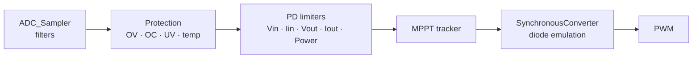

*this document is an LLM generated placeholder*

# Architecture

The firmware is an ESP-IDF application with Arduino as a component. It splits work between the two ESP32-S3
cores so that the real-time control loop never shares a core with networking.

## Task layout

| Core | Runs | Rules |
|---|---|---|
| 1 | `loopRT`: sampling, protection, controllers, PWM | Nothing else is pinned here. The loop blocks on the next ADC sample; never add `vTaskDelay`. |
| 0 | Arduino `loop()` → `loopNetwork_task`, Wi-Fi, lwIP, MQTT, `esp_timer` task | All [services](../reference/services.md) tick here. |

`sdkconfig.defaults` pins Arduino, Wi-Fi/lwIP, mDNS, MQTT and the `esp_timer` task to core 0. `loopRT` checks its
core at startup.

## Control pipeline

Every new ADC sample runs through `loopRTNewData` → `mppt.update()`:

1. **Sampling** (`src/adc/sampling.h`): async reads, round-robin over channels, with notch, median and EWM filters.
   `Vout` is sampled last so the controller reacts to it with minimum latency. See [Sensors](sensors.md).
2. **Protection** (`mppt.protect`, `mppt.protectLf`): hard cut-outs; a violation calls `stopAndBackoff(seconds)`.
3. **PD controllers** (`src/pd_control.h`): the smallest response wins. See [Control Loop](control-loop.md).
4. **MPPT tracker** (`src/tracker.h`): global sweep, then fast and slow perturb & observe.
5. **Converter** (`src/buck.h`): computes the low-side on-time, see [Diode Emulation](diode-emulation.md).

## Configuration and state

| Store | Holds | Changed by |
|---|---|---|
| littlefs `/littlefs/conf/*.conf` | Hardware and behaviour, see [Configuration](../reference/config/index.md) | `set-config`, FTP, [provisioning](../guide/getting-started/provisioning.md) |
| NVS | Wi-Fi networks, hostname, runtime state | Console commands |
| Kconfig | Compiled-in features, see [Build Options](../guide/getting-started/build-options.md) | Rebuild |

## Flash layout

`partitions.csv` defines two OTA slots (`ota_0`, `ota_1`, ~1.87 MB each), a 128 KB `littlefs` partition and a
`coredump` partition. See [OTA Updates](../guide/updating/ota-wifi.md) for the rollback scheme.

## Source map

| Path | Contents |
|---|---|
| `src/main.cpp` | `setup()`, task creation, service wrappers |
| `src/cli.cpp` | Console command dispatcher |
| `src/mppt.*`, `src/tracker.h`, `src/pd_control.h` | Control loop |
| `src/buck.h`, `src/pwm/` | Converter model and gate drivers |
| `src/adc/` | ADC backends and the sampler |
| `src/math/` | Filters and statistics |
| `src/charger.h` | Charge termination |
| `src/tele/` | MQTT, telemetry, FTP, Home Assistant |
| `src/service.h` | Service base class |
| `src/sim/` | Virtual converter |
| `etc/` | Host tools: console client, OTA, config editor, scope |
| `config/` | Board configuration images |
| `test/` | Unit tests |
