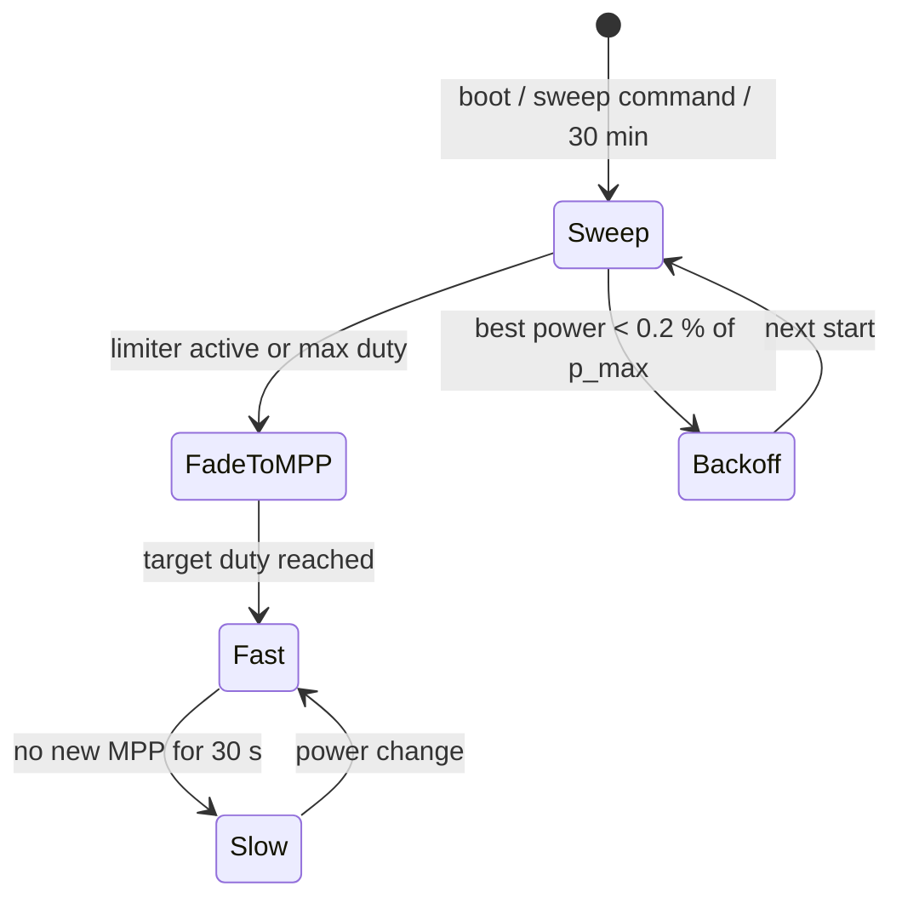

# MPP Tracker

The tracker finds and follows the maximum power point (MPP) of the solar input by moving the converter duty cycle.
It runs inside the [control loop](control-loop.md) only while no limiter is active.

## Phases

Tracking has three phases:

1. **Global sweep**: starting from duty 0, the duty cycle rises while the MPP is captured, until a limiter becomes
   active (input undervoltage, output overvoltage, overcurrent, power limit) or the maximum duty is reached.
2. **Fast tracking**: perturb & observe (P&O) around the captured MPP.
3. **Slow tracking**: P&O with a lower rate, smaller steps and a smaller mean tracking error. A major change in
   power (clouds, partial shading) switches back to fast tracking.

A new global sweep runs every 30 minutes so the tracker does not stay on a local maximum, which happens with
partially shaded strings. A sweep takes 20–60 s depending on the loop rate; sweeping too often or too slowly
costs yield.

## Global sweep

A sweep (`startSweep()` in `src/mppt.h`):

1. disables the converter, clears the fade target and resets the PD controllers,
2. starts a sensor calibration (the periodic re-sweep doubles as periodic calibration),
3. once calibration is done, raises the duty each tick. The step is capped by `sweep_speed` and scaled with the
   distance to the nearest limit, so the ramp slows down when approaching a V/I/P limit,
4. records the sample with the highest smoothed power as the MPP. Samples below 0.2 % of `limits.conf::p_max` (2 W at 1 kW, `sweepMinPower()`) are ignored,
   so a sweep in marginal light cannot "peak" at a near-maximum-duty phantom point.

The sweep stops as soon as any limiter produces a control mode (CV, CC or CP), including the bounce at the maximum
duty. The captured MPP duty becomes the target, and the loop fades to it with a bounded step before handing over to
P&O. If the best captured power is below that floor, no target is committed: the converter shuts down for 30 s and
resumes through the normal start path. This is not a fault: it is logged at info level as
`backoff 30s [sweep-no-mpp]`. A source that cannot deliver it, such as a current-limited bench supply, repeats
this cycle indefinitely.

The sweep is also written to the LCD ("MPP Scan done") and logged as
`Stop sweep ... MPP=(<W>,<duty>,<V>)`.

## Perturb & observe

`Tracker::update()` (`src/tracker.h`) averages power and Vin over one tracker period, then compares the period
mean with the last reference power:

- if the power change exceeds the absolute or relative threshold and is negative, the direction reverses,
- if Vin moved by more than 5 % since the last reversal, the direction reverses as well (cloud recovery: tracking
  a light transient can drift far from the MPP),
- below 1 W the tracker always increases duty.

The tracker keeps its own MPP record. It is reset after 5 min, or when the current power is below 85 % of the
recorded MPP and the record is more than 30 s old.

| Parameter              | Fast mode | Slow mode |
|------------------------|-----------|-----------|
| Update rate            | 30 Hz     | 2 Hz      |
| Step (control value)   | 0.5       | 0.02      |
| Min. power step, abs.  | 1.0 W     | 0.5 W     |
| Min. power step, rel.  | 1.5 %     | 0.15 %    |

Slow mode is entered when power is above 2 W (0.5 W to stay, hysteresis), no new MPP was found for 30 s, and the
direction reversed within the last 15 s (a tracker moving steadily in one direction is not slowed down). On entry
the duty jumps back to the MPP duty captured in fast mode, because output-power measurement (e.g. with a hall
sensor) can be too poor and non-linear for slow P&O alone.

The console command `speed <x>` (0 ≤ x < 10) scales the tracker step (default 1.0).

## When the tracker does not sweep

The periodic re-sweep is skipped when:

| Condition                                             | Why                                                           |
|-------------------------------------------------------|---------------------------------------------------------------|
| PSU / PV-sim mode                                     | No MPP to track; the output is regulated to a setpoint        |
| A sweep is already running                            |                                                               |
| Charge hold (terminated, partial-charge ceiling, too cold) | Ramping duty from 0 would dump a charge pulse into a full pack |
| Control mode is CV (output-voltage limited)           | Same: the pack is full or the output is disconnected          |
| A protection backoff is pending                       | A sweep into an active trip timer would stall                 |

At start-up (and after a shutdown), the sweep additionally waits for the BMS when a BMS cell-voltage topic is
configured: it is skipped while termination is active and the BMS data is fresh, and it waits up to 12 s for the
first termination decision. A fresh-to-stale BMS edge re-arms that wait at most once per 10 min, so a flapping BMS
cannot block the sweep indefinitely. See [Charge Termination](../guide/charging/termination.md).

`tracker.conf::target_duty_cycle > 0` skips the sweep entirely and holds a fixed duty (manual PWM).

## Configuration

| Key                                                                  | Default | Effect                                               |
|----------------------------------------------------------------------|---------|------------------------------------------------------|
| [`sweep_speed`](../reference/config/tracker.md)                      | 4.0     | Sweep speed; scales the per-tick cap and the limit-tracking gain (min 0.1) |
| [`target_duty_cycle`](../reference/config/tracker.md)                | 0.0     | Fixed duty fraction; > 0 disables sweep and P&O      |

Console: `sweep` starts a global sweep, `mppt` returns to automatic tracking, `speed <x>` scales the P&O step. See
[Console](../reference/console.md).
