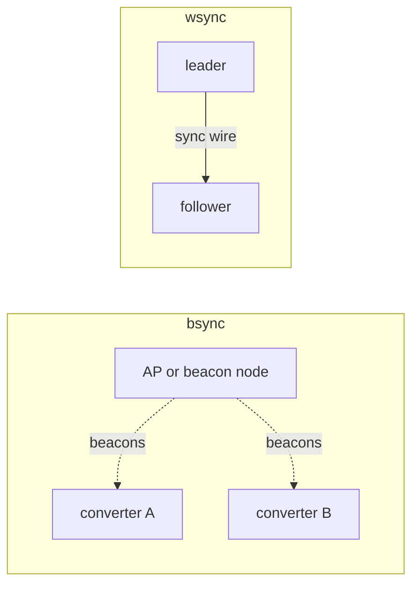

*this document is an LLM generated placeholder*

# Multi-converter sync

Several converters on the same bus can phase-lock their MCPWM switching clocks, wirelessly from Wi-Fi beacons
(`bsync`, µs-class) or over a sync wire (`wsync`, ns-class).

## Why

Free-running converters switch at slightly different frequencies (crystal tolerance, tens of ppm), so their
switching nodes beat against each other. Locking the clocks gives:

- zero average frequency offset between converters, so no beat,
- a fixed, configurable phase between converters, e.g. 180° for interleaved operation.

Both methods need the MCPWM gate driver (`CONFIG_FUGU_WITH_MCPWM=y`, `converter.conf` `pwm_driver=mcpwm`) and
identical `pwm_freq` on all converters. See [PWM Drivers](../pwm-drivers.md).

## Methods compared

| | Beacon sync (`bsync`) | Wired sync (`wsync`) |
|---|---|---|
| Kconfig | `CONFIG_FUGU_WITH_BSYNC` (default `y`, needs `FUGU_WITH_NETW` + `FUGU_WITH_MCPWM`) | `CONFIG_FUGU_WITH_WSYNC` (default `n`, needs `FUGU_WITH_MCPWM`) |
| Timebase | TSF timestamps of 802.11 beacons from one shared AP, received RX-only | Pulse from a leader converter, locked to its timer TEZ |
| Actuation | Software servo (1 Hz) trims the period by dithering it between P and P+1 | Hardware: the follower reloads its timer counter on each sync edge |
| Relative phase | ~±1–3 µs; ±0.5 µs p2p with a dedicated beacon node | Up to one timer tick (6.25 ns) |
| Wiring | None | AC-coupled sync wire and a GPIO per board |
| Configuration | [`bsync.conf`](../../reference/config/bsync.md): `bssid`, `channel`, `phase_us`, `enabled` | `board.conf` `pwm_sync_pin`; `converter.conf` `sync_role`, `sync_phase_deg`, `sync_phase_ns` |
| Radio | Keeps the receiver on in unassociated STA mode, never transmits, also after `wifi off` | Not used |
| Suited for | Frequency lock and coarse phase, no wiring | Degree-level phase, e.g. interleaved current sharing |

## Beacon sync

Each converter sniffs the beacons of the same access point. The hardware stamps both the AP's TSF timestamp (at
transmit) and the local arrival time, so the AP's clock serves as a common view; its own crystal error cancels
between receivers. An alpha-beta filter tracks offset and drift, and the servo feeds the measured drift forward
into the period trim. When beacons go stale (> 3 s) the servo coasts and never reports lock without a fresh
timebase.

A busy household AP next to a switching converter delivers only a fraction of its 10 beacons/s. A dedicated
beacon node (a minimal ESP32-S3 softAP on a quiet channel) gives the full rate and better stability.

- [Beacon Clock Sync (bsync)](beacon-sync.md): mechanism, setup, measured performance
- [bsync Beacon Node](beacon-node.md): the dedicated beacon source

## Wired sync

One converter is `leader` and emits a ~1 µs pulse once per period. `follower` converters reload their timer to 0
on its rising edge, so a follower never runs free for more than one period. The follower period is 2 ticks
shorter than nominal, so the sync only ever truncates an already-wrapped period and the gates keep their normal
dead-band. The phase offset is set on the leader.

:::danger
The sync edge acts on the low-side gate only, so an arbitrary-phase jump does not land in a clean period start;
qualify the wire before arming a follower. See [Wired Clock Sync](wired-sync.md) for the coupling circuit and bench
checklist.
:::

- [Wired Clock Sync (wsync)](wired-sync.md): configuration, coupling circuit, USB-pad variant

## Combining both

A `follower` follows the wire regardless of its own period, so running `bsync` on it has no effect. Use `bsync`
on the leader, or in wireless-only setups.
